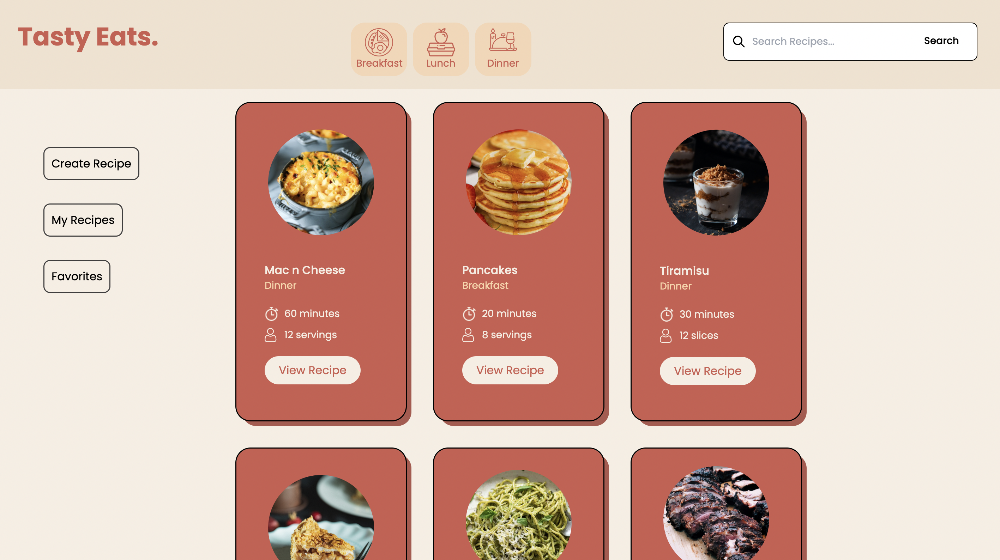
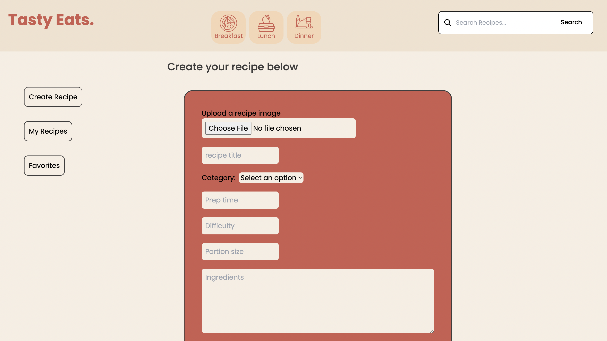
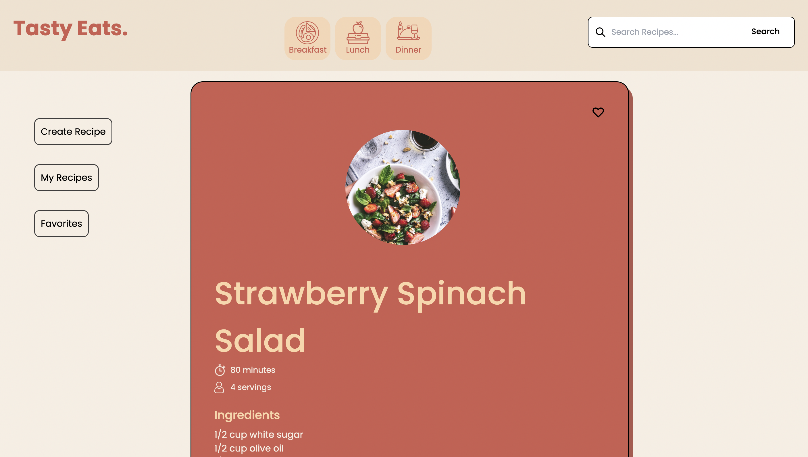
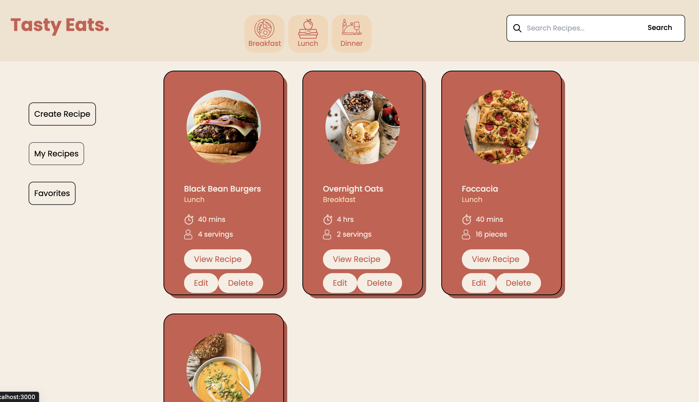
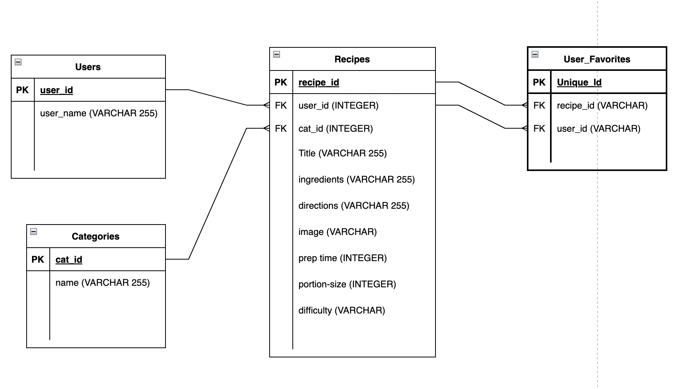
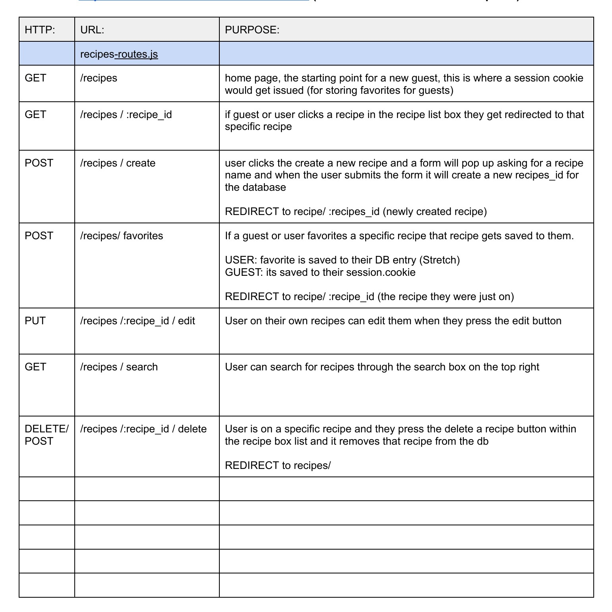

Tasty Eats 
=========

A web app that allows users to create, discover and share their favorite recipes. 

Target audience: Home cooks 

It was built by Kelly Atmore, William Wijaya, Dominik Wrona 


## User Stories

User:
- As a user, I can search for a specific recipe. 

- As a user, I can access all the recipes. 

- As a user, I can create a new recipe. 

- As a user, I can delete my own recipes

- As a user, I can edit my own recipes 
 
- As a user when I create a new recipe I can add a title, ingredients, directions, image, prep time, portion size, difficulty

## Warnings & Tips

## Setup
Install dependencies with `npm install`.
## Running Webpack Development Server
```sh
npm start
```


## Project Stack
__Front-End:__ React, Tailwind CSS
__Back-End:__ Express
__Database:__ Postgres, Firebase

## Screenshots






## Dependencies

- Axios
- Firebase
- Testing-library/jest-dom
- Testing-library/react
- Testing-library/user-event
- React
- React-dom
- React-router-dom
- Web-vitals
- Autoprefixer
- Postcss
- Tailwindcss
 
## ERD



## Routes



